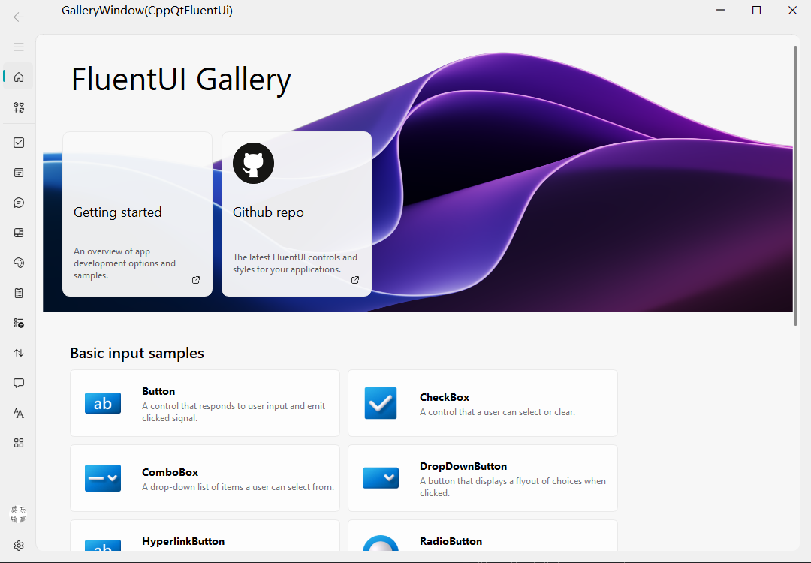

# CppQtFluentUI

#### CppQtFluentUi:采用C++对PyQt-Fluent-Widgets进行重新编写，用以支持C++版的Qt的FluentUi。

## 1.开始

...

## 2.文档

...

## 3.参考

>[ 1] PyQt-Fluent-Widgets: [zhiyiYo/PyQt-Fluent-Widgets: A fluent design widgets library based on PyQt/PySide. Make Qt Great Again. (github.com)](https://github.com/zhiyiYo/PyQt-Fluent-Widgets)
>
>[2] FluentUI [zhuzichu520/FluentUI: FluentUI for QML (github.com)](https://github.com/zhuzichu520/FluentUI)

## 4.许可

> GNU GENERAL PUBLIC LICENSE

## 5.历史

[